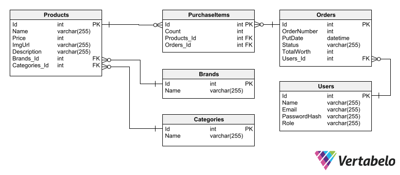

# ElectronicsStore

ElectronicsStore is online shop application, that allows customers to browse and purchase items.

ElectronicsStore is a tool that let customer to search for a specific item or browse products by its kind. Every item can be selected to get every information that is needed like its brand, price, description. And if customer wants to purchase particular item, he can put it into shopping cart.

Shopping carts are collection where customers can easly add items, change quantities, remove items and check total value of it. Items amount in cart is always shown in right corner.

Potential customer can use app being anonymous but to create a purchase order he has to be signed up. To register he needs to provide essential informations like his email, password. Verified customer can continue to create a purchase. Successful purchase is confirmed by popup and some details, which customer could need.

In addition ElectronicsStore provides an administration part, on which administrator can browse through orders letting him to organize system.

## Installation

1.Change your connection string in appsettings.json

```bash
"ConnectionStrings": {
    "ReadingListConnectionString": "Server=.;Database=ReadingListDb;Trusted_Connection=True;TrustServerCertificate=True;"
  },
```

2. Initiate database



Run `update-database` command in Package Manager Console in Persistance project

## CORS Policy

Be sure your port is proper with origins rules placed in `Program.cs`.

```bash
builder.Services.AddCors(options =>
{
    options.AddDefaultPolicy(
        builder =>
        {
            builder.WithOrigins("https://localhost:3000", "http://localhost:3000")
                                .AllowAnyHeader()
                                .AllowAnyMethod();
        });
});
```

## Architecture

This is a web application, which uses Model-View-Controller (MVC) design patter.

Model part is supported by repository-service pattern, which contains businness logic with operations that should be performed by it.

Repository-Service pattern divides the business layer into two semi-layers. Repository handles getting data into and out of database.

Service is responsible for operations on data and passing them between repository and controller.

## Patterns/Technologies:

- ASP.NET Core
- Entity Framework
- Repository Pattern
- Fluent Validation
- AutoMapper
- ErrorHandlingMiddleware
- JWT Bearer Authentication
- PasswordHasher

# Client

User interface is created with usage of React, a JavaScript library.

Client sends requests on port: 7138 by default. You should check if it is proper path for your needs.

`const urlServer = 'https://localhost:7138/api/';`

## Instalation

### `npm start`

Runs the app in the development mode.\
Open [http://localhost:3000](http://localhost:3000) to view it in the browser.

The page will reload if you make edits.\
You will also see any lint errors in the console.

## About

Solbeg 5th Task
